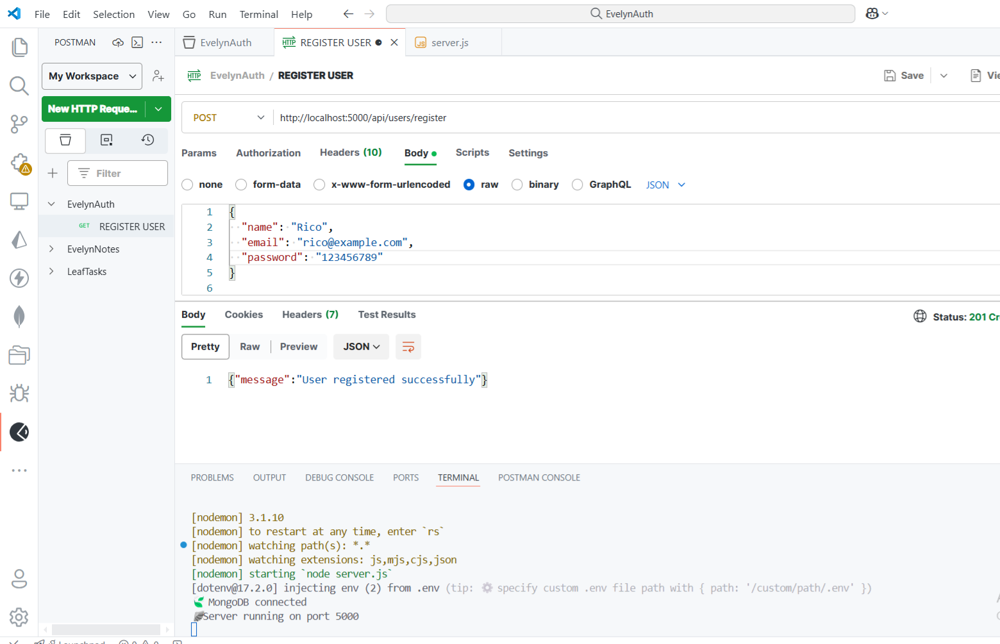
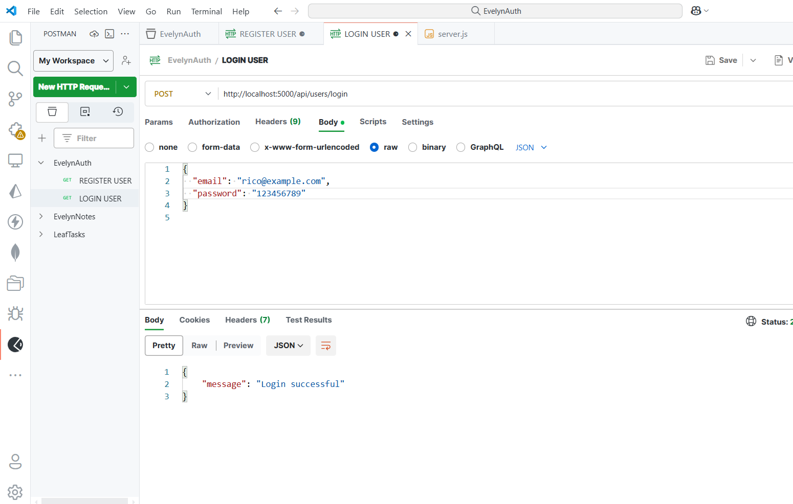
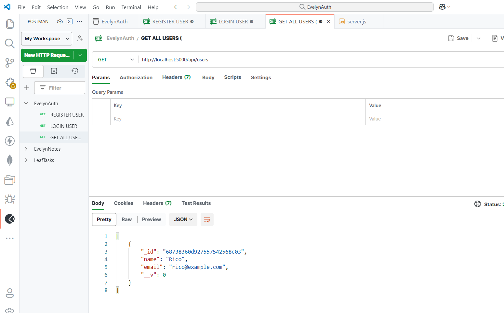

# ⚔️ EvelynAuth - Basic User Authentication (No JWT)

A friendly backend project built with **Node.js**, **Express.js**, and **MongoDB** to handle basic user authentication without JWT or session tokens — just pure logic and clean architecture 

---

## Features

- Register new users (with name, email, password)
- Passwords are hashed using `bcrypt`
- Login users with email and password validation
- Retrieve all registered users (no password exposed)
- No JWT or session — focused on foundational concepts

---

## Tech Stack

- **Node.js**
- **Express.js**
- **MongoDB + Mongoose**
- **bcrypt**
- **Postman** (for testing)

---

## Project Structure

```

EvelynAuth/
├── controllers/
│ └── userController.js
├── models/
│ └── User.js
├── routes/
│ └── userRoutes.js
├── .env
├── .gitignore
├── package.json
├── server.js

```


---

## 📸 API Preview (Postman)

### 🔸 Register User  


### 🔸 Login User  


### 🔸 Get All Users  


---

## 🛠️ Setup Instructions

```bash
# 1. Clone repo
git clone https://github.com/ricoaprillananda/evelynauth-basic.git

# 2. Install dependencies
cd evelynauth-basic
npm install

# 3. Setup .env file
PORT=5000  
MONGO_URI=your_mongo_connection_string

# 4. Run server
npm run dev

```
---

🍃🪽🪽🪽 Author Rico APrilla Nanda
